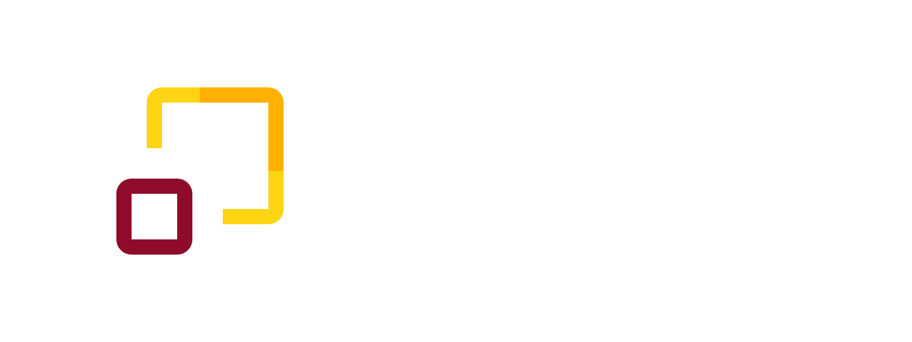

# Urbs - React Component Design System

Urbs, meaning _"lighthouse"_ in Latin, is a component design system built on the foundations of **IBM's Carbon Design System** and **Google's Material Design**. It provides a collection of reusable **React** components that enforce UI consistency and accelerate development within your **React** and **Tailwind** applications.

## Getting Started

To use **Urbs** in your React project:

1. **Installation:**

   ```bash
   pnpm install @quickstay-rooms/urbs
   ```

2. **Import components:**

   ```javascript
   import { Button, Card } from "@quickstay-rooms/urbs"
   ```

3. **Use components:**

   ```jsx
   function MyComponent() {
   	return (
   		<div>
   			<Button>Click me</Button>
   			<Card title="Card title" content="Card content" />
   		</div>
   	)
   }
   ```

## Development

**Urbs** utilizes **Vite** for an efficient development workflow.

1. **Clone the repository:**

   ```bash
   git clone https://github.com/your-username/urbs.git
   ```

2. **Install dependencies:**

   ```bash
   pnpm install
   ```

3. **Start development server:**

   ```bash
   pnpm run dev
   ```

## Contributing

We welcome contributions to Urbs! Please refer to the contributing guidelines within the repository for details on how to submit pull requests.

## License

Urbs is licensed under the Mozilla Public License (MPL). See the LICENSE file for more information.
